# User Flows — Вкус-Робот

> Детальные пользовательские сценарии для Telegram Bot и WebApp

---

## Metadata

```yaml
title: "User Flows"
created_by: "UX Agent"
created_at: "2026-02-04"
version: "1.0"
project: "Вкус-Робот"
phase: "Design"
dependencies:
  - "information-architecture.md"
  - "docs/discovery/prd.md"
  - "docs/discovery/user-stories-detailed.md"
```

---

## 1. Onboarding Flow (Первый запуск)

### 1.1. New User Onboarding

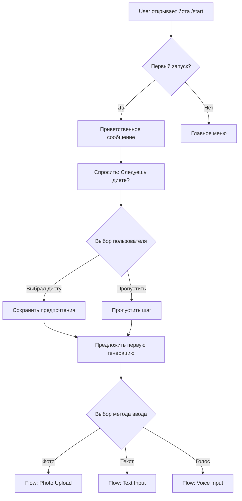

**Детали:**

```yaml
Step 1: Приветствие
  Message: |
    Привет! Я Вкус-Робот 🤖
    Помогу тебе приготовить вкусное блюдо из того, что есть в холодильнике!

    Просто пришли мне фото содержимого холодильника — и я предложу рецепты 👨‍🍳
  Buttons:
    - "Продолжить →"

Step 2: Выбор диеты
  Message: "Следуешь какой-то диете? Это поможет мне подбирать рецепты точнее"
  Buttons (Reply Keyboard, multi-select):
    - Средиземноморская
    - DASH
    - Кето
    - Веган
    - Палео
    - Безглютеновая
    - Интервальное голодание
    - Флекситарианская
    - MIND
    - Низкоуглеводная
    - [Кнопка] "Пропустить"

Step 3: Первая генерация
  Message: "Отлично! Давай попробуем сгенерировать твой первый рецепт"
  Buttons:
    - "📸 Сделать фото холодильника"
    - "✏️ Ввести продукты текстом"
    - "🎤 Голосовой ввод"
```

---

## 2. Core Flow: Генерация рецепта

### 2.1. Photo Upload Flow

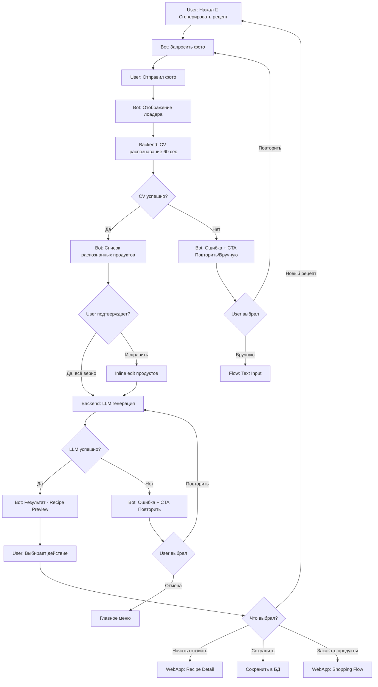

**Детальные шаги:**

```yaml
Step 1: Запрос фото
  Message: "Отлично! Сделай фото содержимого твоего холодильника 📸"
  Tips: |
    💡 Совет: Сделай фото так, чтобы все продукты были хорошо видны
  Buttons:
    - [Кнопка] "Отмена"

Step 2: Лоадер (CV обработка)
  Message: "Анализирую продукты... 🔍"
  Progress:
    - "Распознаю продукты..." (0-30 сек)
    - "Почти готово..." (30-60 сек)
  Timeout: 60 секунд
  Error Handling:
    - Если >60 сек → Показать ошибку timeout

Step 3: Подтверждение списка
  Message: |
    Вот что я нашёл в твоём холодильнике:

    ✅ Помидоры
    ✅ Огурцы
    ✅ Сыр
    ✅ Яйца
    ✅ Молоко

    Всё верно?
  Buttons:
    - "✅ Да, всё верно"
    - "✏️ Исправить"
    - "🔄 Переснять фото"

Step 3.1: Inline Edit (если выбрал "Исправить")
  Message: "Отправь список продуктов через запятую или построчно"
  Example: |
    Пример:
    Помидоры 3 шт, Огурцы 2 шт, Сыр 200г

    или:
    Помидоры 3 шт
    Огурцы 2 шт
    Сыр 200г

Step 4: Лоадер (LLM генерация)
  Message: "Подбираю рецепт... 👨‍🍳"
  Progress:
    - "Анализирую сочетания продуктов..." (0-5 сек)
    - "Создаю рецепт..." (5-15 сек)
    - "Генерирую фото блюда..." (15-25 сек)
  Timeout: 30 секунд

Step 5: Recipe Preview
  Message: |
    🍳 **Итальянский салат Капрезе**

    🕐 Время: 10 минут
    🔥 Калории: 280 ккал
    👤 Порций: 2

    [Фото блюда AI-generated]

    **Ингредиенты:**
    • Помидоры 3 шт
    • Сыр моцарелла 200г
    • Базилик 10г
    • Оливковое масло 2 ст.л.

    **Краткое описание:**
    Классический итальянский салат с помидорами, моцареллой и базиликом.
    Просто, быстро и очень вкусно!
  Buttons:
    - "🍳 Начать готовить" [WebApp]
    - "💾 Сохранить"
    - "🔄 Другой рецепт"
    - "🛒 Заказать продукты" [WebApp]
```

### 2.2. Text Input Flow

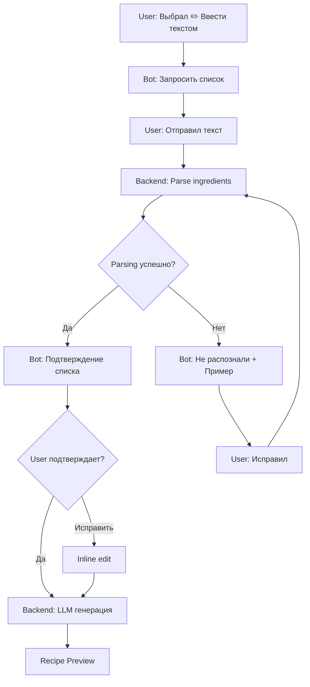

**Детали:**

```yaml
Step 1: Запрос списка
  Message: |
    Отправь список продуктов через запятую или построчно

    Пример:
    Помидоры 3 шт, Огурцы 2 шт, Сыр 200г

    или:
    Помидоры 3 шт
    Огурцы 2 шт
    Сыр 200г
  Buttons:
    - [Кнопка] "Отмена"

Step 2: Подтверждение
  (см. Photo Upload Flow, Step 3)
```

### 2.3. Voice Input Flow

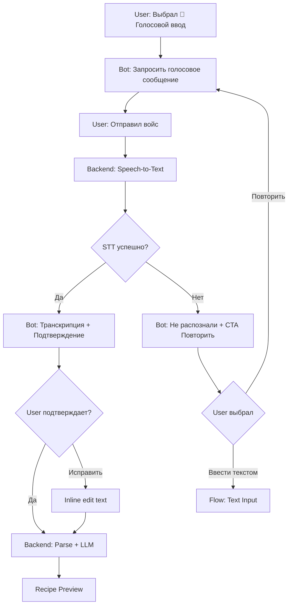

**Детали:**

```yaml
Step 1: Запрос войса
  Message: |
    Запиши голосовое сообщение со списком продуктов 🎤

    Например:
    "Помидоры три штуки, огурцы два штуки, сыр двести грамм"
  Buttons:
    - [Кнопка] "Отмена"

Step 2: Транскрипция
  Message: |
    Я распознал:
    "Помидоры три штуки, огурцы два штуки, сыр двести грамм"

    Всё верно?
  Buttons:
    - "✅ Да"
    - "✏️ Исправить"
    - "🎤 Записать заново"
```

---

## 3. Cooking Flow (Приготовление)

### 3.1. Step-by-Step Cooking Flow

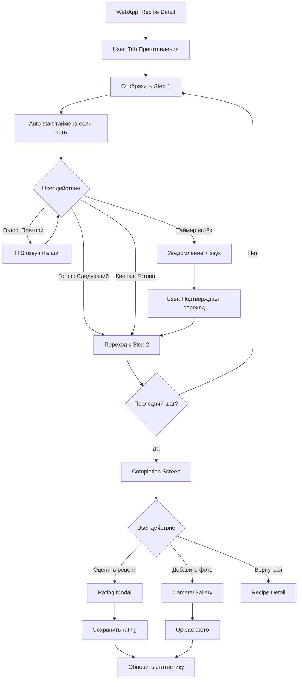

**Детали:**

```yaml
Step Screen Layout:
  Header:
    - Progress: "Шаг 3 из 8"
    - [Кнопка] "Выход" (с подтверждением)

  Body:
    - Номер шага: "Шаг 3"
    - Инструкция: "Разогрей духовку до 180°C"
    - [Таймер] если есть:
        - Время: "15:00"
        - Кнопки: Пауза | Стоп
        - Auto-start при открытии шага
    - [Изображение] если есть

  Footer:
    - [Кнопка] "← Назад"
    - [Кнопка] "Готово, далее →"
    - [Иконка] 🎤 Голосовое управление (toggle)

Голосовые команды:
  - "Следующий шаг" → Next
  - "Назад" → Previous
  - "Повтори" → TTS текущего шага
  - "Пауза" → Pause timer
  - "Старт" / "Продолжить" → Resume timer
  - "Стоп" → Stop timer
  - "Сколько осталось?" → TTS времени таймера

Completion Screen:
  Message: |
    🎉 Поздравляем! Рецепт завершён!

    Как получилось?
  Components:
    - Star Rating (1-5)
    - [Кнопка] "📸 Добавить фото результата"
    - [Кнопка] "💾 Сохранить в избранное"
    - [Кнопка] "🔗 Поделиться"
    - [Кнопка] "Готово"

  Analytics Event:
    - recipe_completed
    - cooking_duration: время от старта до завершения
    - timers_used: количество использованных таймеров
    - voice_commands_used: количество голосовых команд
```

---

## 4. Collection Management Flow

### 4.1. Save to Collection Flow

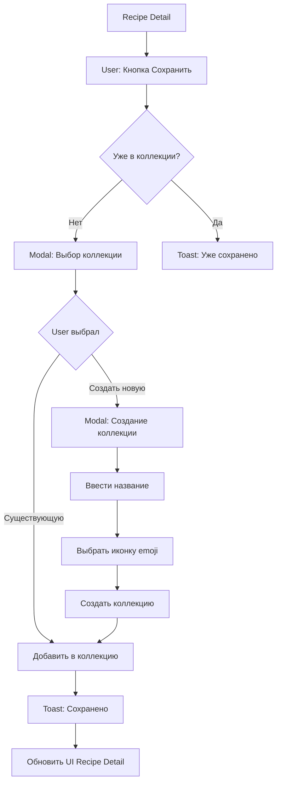

**Детали:**

```yaml
Modal: Выбор коллекции
  Title: "Сохранить в коллекцию"
  List:
    - ⭐ Избранное (дефолтная)
    - 🔥 Завтраки
    - 🍝 Обеды
    - 🍰 Десерты
    - 🥗 Здоровое питание
    - [+ Создать новую коллекцию]
  Buttons:
    - [Кнопка] "Отмена"

Modal: Создание коллекции
  Fields:
    - Input: Название (макс 50 символов)
    - Emoji Picker: Выбор иконки
  Buttons:
    - [Кнопка] "Создать"
    - [Кнопка] "Отмена"

  Validation:
    - Название обязательно
    - Уникальность названия
    - Иконка опциональна (дефолт: 📁)
```

### 4.2. Browse Collections Flow

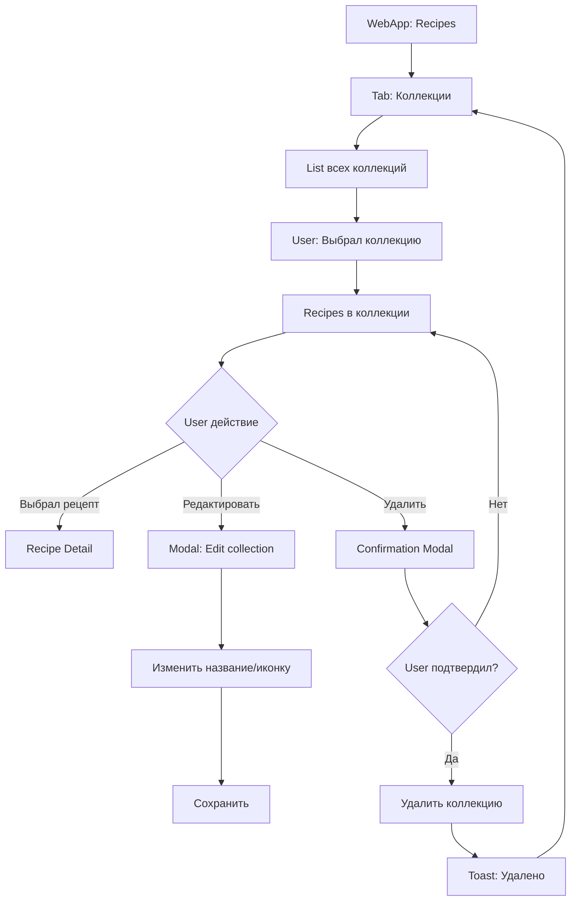

---

## 5. Premium Upgrade Flow

### 5.1. Freemium Paywall Flow

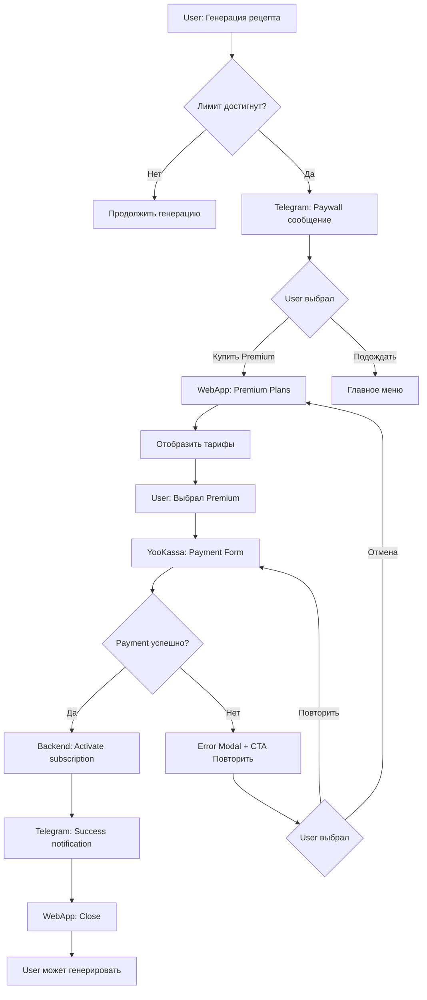

**Детали:**

```yaml
Paywall Message (Telegram):
  Message: |
    Вы использовали все 5 бесплатных генераций сегодня 🎯

    Хотите больше рецептов?
  Buttons:
    - "💎 Купить Premium — 149₽/мес"
    - "⏰ Подождать до завтра"

  Fine Print:
    "Бесплатные генерации обновятся завтра в 00:00"

Premium Plans Screen (WebApp):
  Header: "Выберите тариф"

  Free Plan:
    - Title: "Free"
    - Price: "0₽"
    - Features:
        - 3-5 генераций в день
        - Базовые рецепты
        - Таймеры
        - Сохранённые рецепты
    - [Badge] "Текущий тариф"

  Premium Plan:
    - Title: "Premium"
    - Price: "149₽ / месяц"
    - Features:
        - ✅ Безлимитные генерации
        - ✅ Голосовое управление
        - ✅ Premium-рецепты
        - ✅ Приоритетная поддержка
        - ✅ Экспорт списка покупок
        - ✅ Без рекламы
    - [Кнопка] "Купить за 149₽"
    - [Badge] "🔥 Популярный"

  Footer:
    - "Первые 7 дней бесплатно"
    - "Отменить можно в любой момент"

Payment Flow (YooKassa):
  Step 1: Payment Methods
    - 💳 Банковская карта
    - 🏦 СБП (Система быстрых платежей)
    - 🍎 Apple Pay
    - 🤖 Google Pay

  Step 2: Card Input
    - Номер карты
    - Срок действия
    - CVV
    - [Checkbox] Сохранить карту для автопродления

  Step 3: Confirmation
    - [Кнопка] "Оплатить 149₽"

  Success:
    Message: |
      🎉 Поздравляем!
      Premium подписка активирована

      Теперь вы можете генерировать рецепты без ограничений!
    [Кнопка] "Готово"

  Error:
    Message: |
      ❌ Ошибка оплаты
      [Error message from payment provider]
    Buttons:
      - "Повторить попытку"
      - "Выбрать другой способ оплаты"
      - "Отмена"
```

---

## 6. Shopping Flow (Партнёрская интеграция)

### 6.1. Order Missing Ingredients Flow

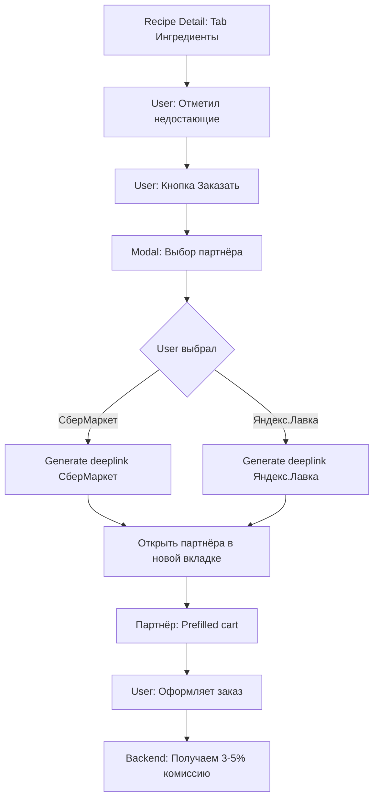

**Детали:**

```yaml
Tab Ингредиенты:
  List:
    - ☑️ Помидоры 3 шт (есть дома)
    - ☑️ Огурцы 2 шт (есть дома)
    - ☐ Сыр моцарелла 200г (недостающий)
    - ☐ Базилик 10г (недостающий)

  Footer:
    - "Недостающих: 2"
    - [Кнопка] "🛒 Заказать недостающие"

Modal: Выбор партнёра
  Title: "Заказать продукты"
  Options:
    - [СберМаркет]
        - Logo
        - "Доставка от 30 минут"
        - "Скидка 10% на первый заказ"
    - [Яндекс.Лавка]
        - Logo
        - "Доставка от 15 минут"
        - "Без минимальной суммы"
  Buttons:
    - [Кнопка] "Отмена"

Deeplink Format:
  СберМаркет:
    sbermarket://cart?items=сыр_моцарелла_200г,базилик_10г

  Яндекс.Лавка:
    yandexlavka://add?products=cheese_mozzarella_200,basil_10

  Fallback (web):
    https://sbermarket.ru/cart?items=...
```

---

## 7. Settings & Profile Flow

### 7.1. Edit Diet Preferences Flow

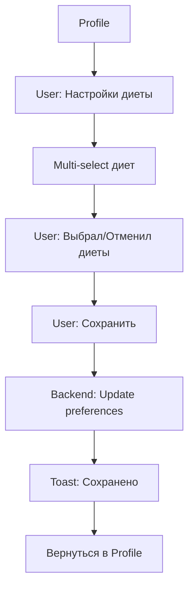

**Детали:**

```yaml
Diet Preferences Screen:
  Header: "Мои диеты"
  Description: "Рецепты будут подбираться с учётом выбранных диет"

  List (multi-select):
    - ☐ Средиземноморская
    - ☑ DASH (выбрано)
    - ☐ Кето
    - ☑ Веган (выбрано)
    - ☐ Палео
    - ☐ Безглютеновая
    - ☐ Интервальное голодание
    - ☐ Флекситарианская
    - ☐ MIND
    - ☐ Низкоуглеводная

  Buttons:
    - [Кнопка] "Сохранить"
    - [Кнопка] "Отмена"
```

### 7.2. Edit Allergens Flow

```yaml
Allergens Screen:
  Header: "Аллергены и нелюбимые продукты"

  Sections:
    1. Аллергены:
       - Input: Добавить аллерген
       - Tags: [Глютен ×] [Лактоза ×] [Орехи ×]

    2. Нелюбимые продукты:
       - Input: Добавить продукт
       - Tags: [Грибы ×] [Оливки ×]

  Buttons:
    - [Кнопка] "Сохранить"
```

---

## 8. Search & Discovery Flow

### 8.1. Search Flow

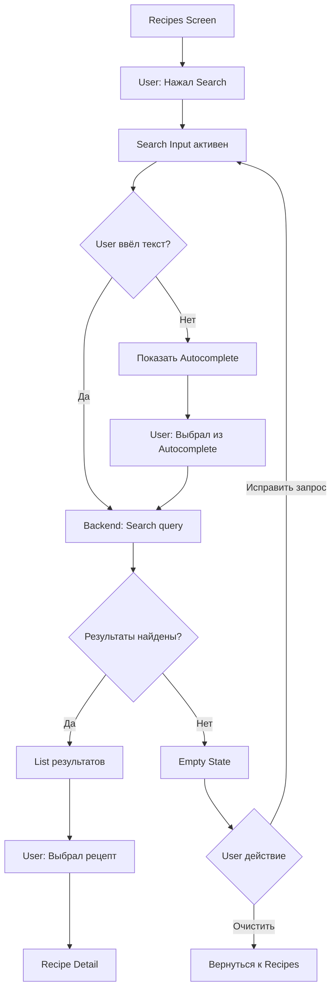

**Детали:**

```yaml
Search Input:
  Placeholder: "Поиск по названию, ингредиентам, кухне..."
  Icon: 🔍
  Clear Button: ×

Autocomplete:
  Sections:
    1. Последние запросы (макс 5)
    2. Популярные запросы
       - "Быстрые завтраки"
       - "Веганские рецепты"
       - "Итальянская кухня"

Empty State:
  Message: |
    По запросу "яблочный пирог" ничего не найдено

    Попробуйте:
    - Проверить правильность запроса
    - Использовать другие ключевые слова
    - Сгенерировать новый рецепт
  [Кнопка] "📸 Сгенерировать рецепт"
```

---

## 9. Error Handling Flows

### 9.1. CV Recognition Failed Flow

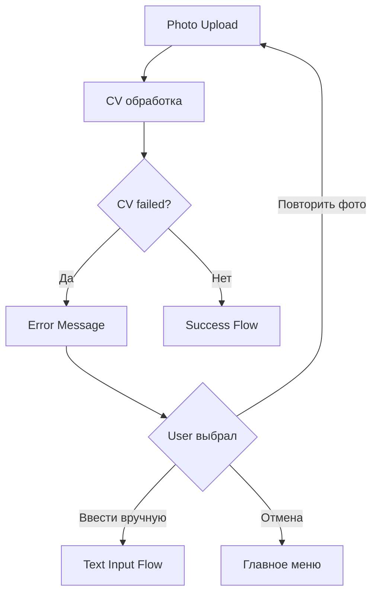

**Error Messages:**

```yaml
CV Recognition Failed:
  Message: |
    ❌ Не удалось распознать продукты

    Возможные причины:
    - Фото слишком тёмное
    - Продукты не в фокусе
    - Слишком много объектов в кадре
  Buttons:
    - "📸 Переснять фото"
    - "✏️ Ввести вручную"
    - "Отмена"

LLM Generation Failed:
  Message: |
    ❌ Не удалось сгенерировать рецепт

    Попробуйте ещё раз через несколько секунд
  Buttons:
    - "🔄 Повторить"
    - "Отмена"

Network Error:
  Message: |
    ❌ Отсутствует подключение к интернету

    Проверьте соединение и попробуйте снова
  Buttons:
    - "🔄 Повторить"
    - "Отмена"

Payment Failed:
  Message: |
    ❌ Ошибка оплаты

    [Детали ошибки от платёжной системы]
  Buttons:
    - "🔄 Повторить оплату"
    - "💳 Выбрать другой способ"
    - "Отмена"
```

---

## 10. Notification Flows

### 10.1. Timer Notification Flow

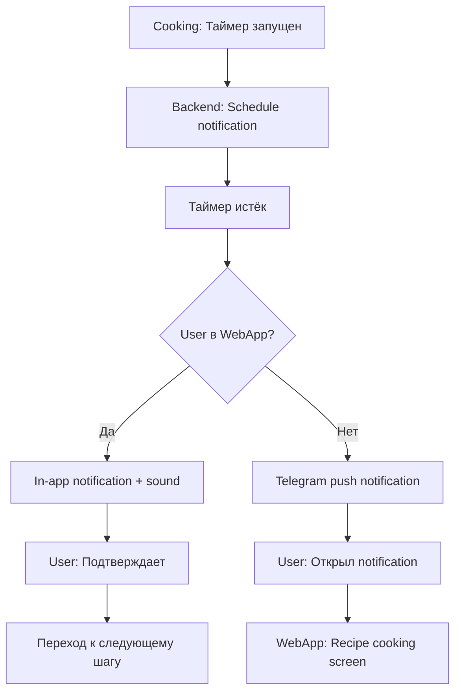

**Notification Formats:**

```yaml
Telegram Push:
  Title: "⏰ Таймер завершён!"
  Body: "15 минут истекло — проверьте блюдо"
  Action: Открыть WebApp на текущем шаге

In-App (WebApp):
  Type: Toast (bottom center)
  Message: "⏰ Таймер: 15 минут истекло!"
  Sound: notification.mp3
  Duration: 5 секунд
  Buttons:
    - "Готово, далее"
    - "Ещё 5 минут"
```

---

## 11. Analytics Events Mapping

### Ключевые события для каждого flow:

```yaml
Onboarding Flow:
  - onboarding_started
  - onboarding_diet_selected: {diet_types}
  - onboarding_diet_skipped
  - onboarding_completed

Generation Flow:
  - recipe_generation_started: {method: photo|text|voice}
  - photo_uploaded
  - cv_recognition_started
  - cv_recognition_completed: {success, products_count, duration}
  - cv_recognition_failed: {error_type}
  - ingredients_confirmed: {products_count, edited}
  - llm_generation_started
  - llm_generation_completed: {duration, recipe_id}
  - llm_generation_failed: {error_type}
  - recipe_preview_viewed: {recipe_id}

Cooking Flow:
  - cooking_started: {recipe_id}
  - cooking_step_viewed: {recipe_id, step_number}
  - timer_started: {recipe_id, step_number, duration}
  - timer_completed: {recipe_id, step_number}
  - voice_command_used: {command_type}
  - cooking_completed: {recipe_id, total_duration}
  - recipe_rated: {recipe_id, rating}

Premium Flow:
  - paywall_shown: {trigger: freemium_limit|feature_locked}
  - premium_plans_viewed
  - premium_plan_selected
  - payment_started: {plan_id}
  - payment_completed: {plan_id, amount, method}
  - payment_failed: {error_type}
  - subscription_activated

Shopping Flow:
  - shopping_initiated: {recipe_id, missing_count}
  - partner_selected: {partner_name}
  - deeplink_opened: {partner_name, items_count}

Collection Flow:
  - recipe_saved: {recipe_id, collection_id}
  - collection_created: {collection_name}
  - collection_viewed: {collection_id, recipes_count}
```

---

## 12. Edge Cases & Error States

### Обработка краевых случаев:

```yaml
Scenario: User закрыл WebApp во время cooking
  Handling:
    - Backend: Сохранить прогресс (текущий шаг)
    - При возврате: Предложить продолжить с того же места
    - [Кнопка] "Продолжить приготовление"
    - [Кнопка] "Начать сначала"

Scenario: User потерял интернет во время генерации
  Handling:
    - Показать offline indicator
    - Сохранить запрос локально (если возможно)
    - При восстановлении: Auto-retry или предложить повторить

Scenario: Платёж успешен, но webhook не пришёл
  Handling:
    - Polling статуса платежа каждые 5 сек (макс 60 сек)
    - Если не пришёл → Эскалация в support
    - User видит: "Проверяем статус оплаты..."

Scenario: User достиг freemium лимита во время генерации
  Handling:
    - Завершить текущую генерацию (не прерывать)
    - После завершения → Показать paywall

Scenario: Таймер истёк, но user не на экране
  Handling:
    - Telegram push notification
    - При возврате: Уведомление + переход к следующему шагу

Scenario: CV распознал <3 продуктов
  Handling:
    - Показать warning: "Распознано мало продуктов"
    - Предложить: "Добавить ещё продукты вручную?"
    - Buttons:
        - "Добавить вручную"
        - "Продолжить с тем, что есть"
        - "Переснять фото"

Scenario: LLM вернул неадекватный рецепт
  Handling:
    - Фильтр на backend (валидация JSON schema)
    - Если fail → Retry с другим промптом (макс 2 раза)
    - Если всё равно fail → Error message + support

Scenario: User пытается сгенерировать без ингредиентов
  Handling:
    - Validation: Минимум 2 ингредиента
    - Error: "Добавьте хотя бы 2 продукта"
```

---

## 13. Next Steps

После утверждения User Flows:

1. **Wireframes** — low-fidelity прототипы каждого экрана
2. **Interactive Prototype** — кликабельный прототип (Figma)
3. **Usability Testing** — тестирование flows на 5-8 пользователях
4. **Refinement** — итерация на основе feedback

---

*Документ создан: UX Agent | Дата: 2026-02-04*
